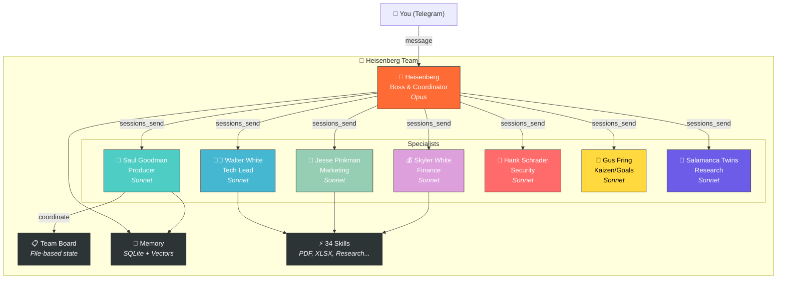

# 🧪 Heisenberg Team

> ⚠️ **Перед началом:** Замените `YOUR_USERNAME` на ваш GitHub username в командах клонирования.

**Мультиагентная система из 8 AI-агентов, работающих как команда.** Построена на [OpenClaw](https://github.com/openclaw/openclaw). Вдохновлена Breaking Bad.

[](LICENSE)
[](https://github.com/openclaw/openclaw)
[]()
[]()

---

## Оглавление

- [Что это?](#что-это)
- [Зачем?](#зачем)
- [Чем отличается?](#чем-отличается)
- [Архитектура](#архитектура)
- [Агенты](#агенты)
- [Быстрый старт](#быстрый-старт)
- [Скиллы (34)](#скиллы-34)
- [Структура проекта](#структура-проекта)
- [Примеры](#примеры)
- [Документация](#документация)
- [Вклад](#вклад)
- [Лицензия](#лицензия)

---

## Что это?

Готовый шаблон для запуска **команды AI-агентов**, которые общаются между собой, делегируют задачи и доставляют результат. У каждого агента - своя роль, характер и набор скиллов.

Это не фреймворк. Это **рабочая система**, которую можно клонировать, настроить и запустить.

## Зачем?

- **Один босс, семь специалистов.** Вы говорите с Хайзенбергом. Он делегирует правильному агенту. Вы получаете результат.
- **34 скилла.** Генерация PDF, исследования, маркетинг, аудиты безопасности, финансовый учёт, код-ревью — из коробки.
- **Board-First протокол.** Задачи переживают краши. Файловое состояние, не память. Никакая работа не теряется.
- **Самоисцеление.** Health checks, watchdogs, автоматическая очистка сессий. Система мониторит себя сама.
- **Ваши данные остаются вашими.** Все личные данные используют формат `{{PLACEHOLDER}}`. Мастер настройки заполняет их за 5 минут.

## Чем отличается?

| Особенность | Heisenberg Team | AutoGPT | CrewAI | MetaGPT |
|-------------|----------------|---------|--------|---------|
| Настройка | Мастер 5 минут | Ручной YAML | Код на Python | Код на Python |
| Восстановление после краша | Файловый board переживает перезапуски | В памяти, теряется при крахе | В памяти | В памяти |
| Координация агентов | Board-First протокол + sessions_send | Общая память | Последовательно/иерархически | На основе SOP |
| Самоисцеление | Встроено (на основе cron) | Нет | Нет | Нет |
| Библиотека скиллов | 34 готовых | Экосистема плагинов | Пишите сами | Пишите сами |
| Личность | Постоянный SOUL.md для каждого агента | Общая | Описание роли | Описание роли |
| Память | SQLite + векторный поиск + файлы | Vector DB | Только краткосрочная | Общая память |
| Мониторинг | Heartbeat + health checks | Только логи | Только логи | Только логи |
| Мультиплатформенность | macOS + Linux + WSL | Docker | Python | Python |

## Архитектура


## Агенты

| Агент | Персонаж | Роль | Ключевые скиллы |
|-------|----------|------|-----------------|
| **Heisenberg** | Уолтер Уайт | Босс | Делегирование, доставка |
| **Saul** | Сол Гудман | Координатор | Пайплайн, брифинги |
| **Walter** | Уолтер Уайт (лаб.) | Тимлид | Код, PDF, GitHub |
| **Jesse** | Джесси Пинкман | Маркетинг | Воронки, кампании |
| **Skyler** | Скайлер Уайт | Админ/Финансы | DOCX, XLSX, договоры |
| **Hank** | Хэнк Шрейдер | Безопасность/QA | Аудиты, мониторинг |
| **Gus** | Гус Фринг | Кайдзен | Кроны, самоулучшение |
| **Twins** | Братья Саламанка | Ресёрч | Глубокий ресёрч |

## Требования

- [Node.js](https://nodejs.org/) v18+
- [OpenClaw](https://github.com/openclaw/openclaw) (`npm install -g openclaw`)
- API-ключ хотя бы одного LLM-провайдера (Anthropic, OpenAI, Google)
- Telegram-бот токен (опционально, для уведомлений через [@BotFather](https://t.me/BotFather))

### Системные требования

| | Минимум | Рекомендовано |
|---|---------|-----------------|
| RAM | 2 GB | 4 GB (8 агентов) |
| Диск | 500 MB | 2 GB (с логами/памятью) |
| ОС | macOS 11+, Ubuntu 20.04+, Windows 11 (WSL2) | macOS 13+ или Ubuntu 22.04+ |
| Node.js | 18.x | 20.x+ |
| Сеть | Необходима (вызовы LLM API) | Широкополосный доступ |

## Быстрый старт

```bash
# 1. Клонировать
git clone https://github.com/YOUR_USERNAME/heisenberg-team.git
cd heisenberg-team

# 2. Настроить
cp .env.example .env
# Отредактируй .env своими значениями

# 3. Установить
bash scripts/setup.sh

# 4. Запустить
openclaw gateway start
```

Подробная инструкция: [SETUP.md](SETUP.md)

## Скиллы (34)

Команда использует библиотеку из 34 скиллов:

- **Контент:** copywriter, youtube-seo, presentation, pptx-generator
- **Ресёрч:** researcher, deep-research-pro, channel-analyzer, reddit
- **Документы:** minimax-pdf, minimax-docx, minimax-xlsx, nano-pdf
- **Разработка:** coding-agent, cursor-agent, github-publisher
- **Автоматизация:** n8n-workflow-automation, blogwatcher, browser-use
- **Аналитика:** analytics, audit-website, business-architect
- **Специализированные:** family-doctor, auto-mechanic, weather и другие

Полный список в [skills/](skills/).

## Структура проекта

```
heisenberg-team/
├── agents/          # 8 агентов, каждый со своими конфигами
├── skills/          # 34 общих скиллов
├── scripts/         # Утилиты
├── references/      # Конституция команды, стандарты
├── examples/        # Кукбуки и гайды
├── docs/            # Архитектура, FAQ
└── assets/          # Картинки для документации
```

## Примеры

- [Добавить нового агента](examples/add-new-agent.md)
- [Создать скилл](examples/create-skill.md)
- [Настроить крон-задачи](examples/configure-crons.md)

## Документация

- [Апгрейд с одного агента](docs/upgrade-from-single-agent.md) - миграция с single-agent setup
- [Поддерживаемые провайдеры](SETUP.md#supported-llm-providers) - Anthropic, OpenAI, Google, Ollama
- [Онбординг агентов](docs/agent-onboarding.md) - настройка при первом запуске
- [Архитектура](docs/architecture.md)
- [Роли агентов](docs/agent-roles.md)
- [Установка на Linux](docs/linux-setup.md)
- [FAQ](docs/faq.md)

## Лицензия

[MIT](LICENSE)

---

*Построено на [OpenClaw](https://github.com/openclaw/openclaw) - open-source платформе для AI-агентов.*
